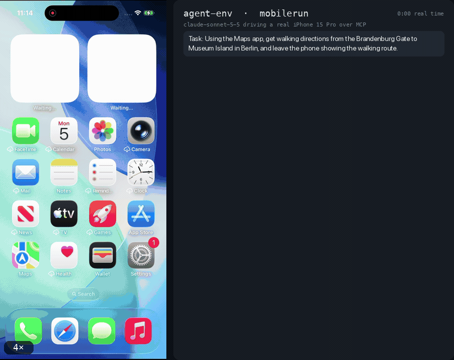

# MobileRun for AgentEnv

[](https://github.com/kaihackney-scale/agentenv-mobilerun/actions/workflows/tests.yml)
[](LICENSE)
[](https://www.agentenvframework.com)

AI agents drive real phones. This plugin turns a [MobileRun](https://mobilerun.ai) cloud phone, a real iPhone or
Android device in a data centre, into an environment an agent drives through eighteen MCP tools: it reads the screen,
taps, swipes, types and opens apps, and the device itself records video and a timed trajectory of every action.
Environments are not limited to services; any interface an agent can act on can be one, and a phone is about as
real an interface as there is. This repository is an environment plugin for the
[AgentEnv Framework](https://www.agentenvframework.com), Scale AI's open-source framework for building RL
environments.



*Claude Sonnet 5.5, given one sentence, drives a real iPhone 15 Pro on MobileRun to walking directions from the
Brandenburg Gate to Museum Island: it opens Maps from the home screen, searches, notices its query was cut to "Mus",
clears and retypes it, types the start point by hand (Location Services is off on the phone) and switches to walking.
23 tool calls in 2 minutes 23 seconds, shown at 4×. On the right, what the model wrote before each action and every
`mobilerun_*` call with its result; on the left, the device's own server-side recording, with each tap ringed where and
when the device registered it. The run ends on an end-state check read from the phone's `ui_state` after the model said
it was done: Museum Island on screen, walking mode, a duration.*

**Contents:** [Run it yourself](#run-it-yourself) · [Built on the AgentEnv Framework](#built-on-the-agentenv-framework) ·
[The environment's tools](#the-environments-tools) · [Recording](#recording) · [What has been verified](#what-has-been-verified) ·
[Known limits](#known-limits) · [Troubleshooting](#troubleshooting) · [Repository layout](#repository-layout) ·
[Contributing](#contributing) · [Development](#development)

## Run it yourself

You need Docker, Python 3.11 or newer, a MobileRun account with an API key (`dr_sk_...`, from their API Keys page) and
a device on it. Android and bring-your-own devices are self-serve; a rented iPhone currently means contacting
MobileRun's team ([pricing](https://mobilerun.ai/pricing)).

```bash
pip install agentenv-framework
agent-env plugin add 'agentenv-mobilerun @ git+https://github.com/kaihackney-scale/agentenv-mobilerun'
export MOBILERUN_API_KEY=dr_sk_...

agent-env mobilerun doctor --skip-agent --platform ios   # key, devices, capabilities, a screenshot health probe
agent-env mobilerun setup --id mobilerun --platform ios  # build the MCP server image, register the env
agent-env env deploy --id mobilerun                      # resolve an idle phone and deploy it
```

That is the whole installation: the env type, the task step, the bundle and the `agent-env mobilerun` commands
register themselves through entry points, so there is nothing to add to `.agentenv/config.toml`. `setup` builds the
image locally and registers it in agent-env's own image store, so there is no registry to pull from and nothing to
`docker login` to. It builds `linux/amd64` by default, for remote sandbox VMs; on Apple Silicon with the local sandbox,
`--build-platform linux/arm64` builds a native image instead of an emulated one. The deploy ends like this:

```
Deployed!
Instance ID: mobilerun-...
Env MCP Url: http://127.0.0.1:62694/mcp
```

Hand that MCP URL to an agent, or to any MCP client, and it has a phone. `setup --device ID` pins one device; without
it each deploy resolves an idle one that passes its health probe. Use the same `--platform` for `doctor` and `setup`:
`doctor` defaults to Android, and checks for a device of that platform.

### The bundled task

The package also ships a bundle, `mobilerun`: deploy the env, hand the phone to an agent, ask it to open Settings and
the display screen, and collect the recording. The recording only exists if the env was set up with `--record`;
without it the collect step finds nothing and says so.

```bash
agent-env mobilerun setup --id mobilerun --platform ios --record
agent-env run                                  # lists the installed bundles; mobilerun is one
agent-env mobilerun doctor --platform ios      # this time without --skip-agent
agent-env run mobilerun
```

**It needs an A2A agent, and agent-env ships none.** The task's `deploy_agent` step names no agent, so it deploys
your configured default: `[agents] default_a2a_agent_id` in `.agentenv/config.toml`, else `a2a-default`, which on a
clean install does not exist. Point the setting at any A2A agent that drives MCP tools, or register one under that id
with `agent-env a2a-agent put --id a2a-default --dockerfile path/to/your/agent/Dockerfile`; the protocol package's
`a2a_agent` SDK (`pip install 'agentenv-framework-protocol[agent]'`) is one way to build it. The task names no agent so
that your default wins, which means agent-env's own run preflight cannot see a missing one; `doctor` resolves it the
way `deploy_agent` does and fails first, before any phone or gateway is spent.

## Built on the AgentEnv Framework

This plugin is built on the [AgentEnv Framework](https://www.agentenvframework.com)
([GitHub](https://github.com/scaleapi/agentenv-framework), `pip install agentenv-framework`): Scale AI's open-source
framework for building RL environments, with composable environments behind an MCP gateway, any agent in any
sandbox, and tasks as DAGs. The framework does the heavy lifting; this repository adds the phone.

```
┌────────────────────────────┐        ┌──────────────────────┐        ┌───────────┐
│ agent-env gateway          │        │  api.mobilerun.ai    │        │  a real   │
│  ┌──────────────────────┐  │ HTTPS  │                      │        │   phone   │
│  │ mobilerun MCP server │──┼───────▶│  device plane (REST) │───────▶│           │
│  └──────────────────────┘  │        └──────────────────────┘        └───────────┘
└────────────────────────────┘
```

One container. No host machine, no USB, no WebDriverAgent, no device pool: a cloud phone needs outbound HTTPS and
nothing else. Each piece maps to a framework concept:

| AgentEnv concept | Here |
|---|---|
| [Environment](https://www.agentenvframework.com/docs/environments/creating): MCP tools and an env card in one container | `src/agentenv_mobilerun/server/main.py`: up to 18 `mobilerun_*` tools, gated by what the phone supports, plus the env card and core data plane served by the protocol SDK (no data operations: a phone has no database to load); `env.py`: `MobileRunEnv`, which resolves and health-probes a phone, then deploys the server behind an agent-env gateway |
| [Plugin](https://www.agentenvframework.com/docs/plugins/environment-plugins): a pip package with entry points | `pyproject.toml`: the env (`agent_env.envs`), the task step (`agent_env.task_steps`), the bundle (`agent_env.bundles`) and the `agent-env mobilerun` commands (`agent_env.cli_plugins`) |
| [Task steps](https://www.agentenvframework.com/docs/plugins/task-step-plugins) | `mobilerun_collect_recording` in `src/agentenv_mobilerun/steps/collect_recording.py` |
| [Tasks](https://www.agentenvframework.com/docs/tasks/creating) | `src/agentenv_mobilerun/bundles/mobilerun/`: the `open-settings` task and the `smoke` eval, run with `agent-env run mobilerun` |
| [Agents](https://www.agentenvframework.com/docs/agents/creating): A2A agents handed the env's MCP server | none shipped: any A2A agent that drives MCP tools; the task deploys your default |
| [Registry](https://www.agentenvframework.com/docs/registry): versioned images, envs and runs | `agent-env mobilerun setup` registers the image artifact and the env; deploys and recordings go to your configured stores |

Start with the framework's [getting started](https://www.agentenvframework.com/docs/getting-started) and
[core concepts](https://www.agentenvframework.com/docs/core-concepts) to build an environment of your own.

## The environment's tools

Eighteen tools, **capability-gated per device**: the env reads the phone's capability map at deploy time and
registers only what that phone can honour, so an agent never sees a tool that is guaranteed to fail. Two phones on
one account can legitimately differ. Every coordinate is in screenshot pixels.

| Tool | What it does |
|---|---|
| `mobilerun_screenshot` | Capture the screen; coordinates read off it are what the gesture tools take, unscaled |
| `mobilerun_screen_size` | The screenshot's pixel size, the device's point size and the ratio between them |
| `mobilerun_ui_state` | The labelled on-screen elements with tappable centres, the app and keyboard state; compacted from the raw tree |
| `mobilerun_wait` | Sleep, then let the caller take a fresh screenshot |
| `mobilerun_wait_ready` | Block until the device plane calls the phone ready |
| `mobilerun_tap` | Tap a point |
| `mobilerun_double_tap` | Tap a point twice |
| `mobilerun_long_press` | Press and hold a point |
| `mobilerun_swipe` | Drag from one point to another |
| `mobilerun_scroll` | Scroll by swiping across the middle of the screen |
| `mobilerun_type_text` | Type into the focused field, waiting for the text to land |
| `mobilerun_clear_text` | Clear the focused field |
| `mobilerun_press_key` | A system key by name: `home` and `back` on an iPhone, the Android accessibility actions on Android |
| `mobilerun_list_apps` | The installed apps |
| `mobilerun_launch_app` | Bring an app to the foreground by package name (Android) or bundle id (iOS) |
| `mobilerun_open_deep_link` | Open a URL or deep link directly |
| `mobilerun_get_clipboard` | Read the clipboard |
| `mobilerun_set_clipboard` | Write the clipboard |

### The coordinate contract

**You work in screenshot pixels.** Read a coordinate off the image and pass it in unchanged; the conversion happens
server-side, once. It is not cosmetic. On a live iPhone 15 Pro:

| | |
|---|---|
| `screenshot` returns | **1179 × 2556** physical pixels |
| `POST /devices/{id}/tap` expects | **393 × 852** logical points |
| ratio | exactly **3.0** |

The device plane taking points rather than pixels is undocumented (the schema is a bare integer pair), so it was
established from a recorded trajectory of taps sent through that same endpoint: they land at `x=196`, the centre of a
393-point screen, where the pixel centre would be 589. Passing pixels straight through misses by 3×, which puts most
of the screen out of bounds. The plugin resolves the ratio once per device and routes every gesture through one
conversion; every gesture result echoes both spaces, e.g. `{"x": 589, "y": 1278, "device_point": [196, 426]}`, so a
trace shows what was aimed at and what was sent. If the ratio cannot be established, coordinates pass through
unchanged and the fact is logged loudly.

### `ui_state` is compacted, deliberately

The raw accessibility tree is not usable as a tool result: on a live iPhone it is 183 KB, about 46,000 tokens across
412 nodes, of which 85 carry a label. `mobilerun_ui_state` returns the labelled elements with their centres, the
notable flags and the app and keyboard state, about 1,700 tokens, and declares `elements_total` and `truncated` so a
caller can see what was filtered. `isClickable` is `false` on every node of a real iPhone tree (it is an Android
field), so it is neither reported nor used as a filter; filtering on it would drop the whole screen.

## Recording

MobileRun records **server-side**, which is strictly better than anything a client can do. Opt in at setup:

```bash
agent-env mobilerun setup --id mobilerun --record
```

Each deploy then starts a video and trajectory recording. Add the collect step after the step that prompts your
agent:

```json
{ "id": "collect", "type": "mobilerun_collect_recording", "key_prefix": "recordings" }
```

The trajectory carries exact coordinates, `seq`, `at_ms`, gesture durations, the display scale and rotation, a
`valid`/`reasons` contract, and the part a client-side recorder cannot know: `video.timeline.action_zero_to_video_ms`
with an `uncertainty_ms`, the action-clock to video-clock offset measured by the device that captured both. That is
how the gif above was cut: each tap's `at_ms` says where it is in the video. The step copies both artifacts into
**your** configured object store, because the video route answers a 302 to a presigned URL that expires in 900
seconds, and each recording has a `retentionDays` after which MobileRun returns 410 Gone.

> ⚠️ **A recording captures whatever is on screen**, not just the task: notifications, whatever app was open, any
> signed-in account, and whatever screen the last user left an app on. Settings reopens where it was left, which can
> be General > About with the phone's serial number and IMEI. Recording is **off by default**, nothing here publishes
> anywhere, and anything you publish from a recording should be checked frame by frame.

## What has been verified

**Live, 2026-10-05**, on rented iPhone 15 Pros, published `agentenv-framework` 0.9.1267 and the local sandbox:
`setup`, `env deploy`, the env card the gateway composes (with this server's own card as its `mobilerun` child), all
18 tools listed through the gateway, `screenshot`, `ui_state`, `tap`, `scroll`, `type_text` (plain and with `clear`)
and `press_key home` executing and observed on the device, the server-side recording and its trajectory, teardown
through the env's reattach and `close()`, and a model (Claude Sonnet 5.5, by function calling against the env's MCP
tools) completing a 23-step task end to end: the gif above.
Earlier, on 2026-09-21: device listing and resolution, the capability map, the health probe, `doctor`, the
pixel-to-point conversion, screenshots, `ui_state` compaction, `list_apps` and the full recording download path.

**Not verified yet**: anything on **Android** (the account's only Android device is in maintenance), so treat the
Android path, including `press_key`'s Android codes, as unexercised; the bundle's `agent-env run mobilerun`, which goes
through an A2A agent rather than a model calling the tools directly; and `clear_text`, `double_tap`, `long_press`,
`open_deep_link` and the clipboard tools on a device. See
[Known limits](#known-limits) for `launch_app`.

## Known limits

Stated rather than papered over.

- **No exclusivity.** MobileRun's device plane has no lease or reservation primitive, and neither does this plugin.
  Two deploys against one account can resolve the same phone and both drive it. Pin distinct devices with `--device`,
  or run one job per device.
- **`state` is not health.** A phone can report `state: "ready"` while being completely undrivable. Everything here
  health-probes with a screenshot instead, and `devices --probe` exposes the same check.
- **`launch_app` on iOS needs care.** On one iPhone, launching Settings by bundle id returned `ok`, Settings never
  opened, and the phone stopped answering screenshots and gestures while still reporting `ready`. Tapping the app's
  icon instead worked on another phone. One case, so not a rule, but prefer the icon on iOS until it is understood.
- **Location Services is off on MobileRun's phones.** Maps and anything else that needs "my location" asks for a start
  point instead, so give tasks explicit places.
- **A badged icon is labelled by its badge.** In an iPhone's accessibility tree, the Settings icon with a red badge
  is labelled `1 new item`, not `Settings`. Find icons by what the screenshot shows, not by label alone.
- **`press_key` codes are Android's.** `POST /devices/{id}/global` takes a bare integer and documents no enum. On an
  iPhone, `home` is verified and `back` is expected; use `agent-env mobilerun probe-global` to check the rest.
- **`ui_state` is declared as `AndroidState`** in MobileRun's OpenAPI spec even on an iPhone, where the contents are
  XCUIElement-shaped. Don't write a parser that trusts the declared schema.
- **`long_press` and `double_tap` are composed** from the tap and swipe primitives; the device plane has neither.
- **No factory reset in the run loop.** `Env.reset()` presses home and nothing else. MobileRun's `POST
  /devices/{id}/reset` clears installed apps and user data; it is reachable as `MobileRunClient.factory_reset` for an
  operator who means it, and is never wired into a task.

## Troubleshooting

**`no MobileRun API key found`**: export `MOBILERUN_API_KEY`, or add it to the secret store your `config.toml`
configures under that name. An exported but empty variable counts as absent.

**`device X reports state='ready' but failed its screenshot health probe`**: the phone is degraded below anything this
plugin controls. Reboot it from the MobileRun dashboard; if that does not clear it (a reboot can make things worse),
it is a MobileRun support item.

**`no idle ready device`**: the message lists every device and its state. A device with an active task is not idle.

**A tool is missing from the agent's list**: the phone's capability map says it is unsupported. `agent-env mobilerun
doctor` prints the supported and unsupported sets.

**`agent-env run mobilerun` fails at `deploy_agent`**: there is no default agent. See
[The bundled task](#the-bundled-task); `agent-env mobilerun doctor` reports it.

## Commands

| Command | What it does |
|---|---|
| `agent-env mobilerun doctor [--skip-agent]` | The four checks that explain every failure (key, devices, capabilities, health probe) and the agent `agent-env run mobilerun` deploys. Exits non-zero if the bundle could not run, or with `--skip-agent` if the env could not deploy, so it works as a CI gate |
| `agent-env mobilerun devices [--probe]` | List devices; `--probe` screenshots each one to prove it is drivable |
| `agent-env mobilerun setup` | Build the MCP image and register the env (`--device`, `--record`, `--platform`) |
| `agent-env mobilerun probe-global --device ID --yes` | Discover what the undocumented `global` action codes do on a device |

## Repository layout

```
src/agentenv_mobilerun/
  env.py                MobileRunEnv: resolve and health-probe a phone, deploy the MCP server behind a gateway
  client.py             the device-plane client, on MobileRun's official mobilerun-sdk
  server/               the MCP server image: main.py (tools, env card), Dockerfile, requirements.txt
  steps/                the mobilerun_collect_recording task step
  cli.py                agent-env mobilerun: doctor, devices, setup, probe-global
  capabilities.py       the capability map's wire encoding, shared by the env and the server
  api_key.py            key resolution, free of agent-env so doctor runs without it
  bundles/mobilerun/    the open-settings task and the smoke eval
examples/               the same task as a standalone JSON, with notes on supplying an agent
tests/                  client, server, env, CLI, recording and env-card tests; no device or network needed
docs/media/             the demo gif
```

## Contributing

Contributions are welcome: new tools, Android verification, tasks and docs. Open an issue to discuss a larger change
first, then send a pull request; CI must pass, and a maintainer reviews every pull request before it merges.

## Development

```bash
uv venv && uv pip install -e '.[dev]'
.venv/bin/pytest                          # 177 tests
.venv/bin/ruff check --select F821 src tests
```

`[dev]` installs `agentenv-framework` on Python 3.11 and newer, so the whole suite runs. On 3.10 the half the container
ships (the client and the MCP server) still runs and the framework-dependent modules skip themselves. The image
installs neither extra (see `src/agentenv_mobilerun/server/requirements.txt`): keeping the framework out of it is what
lets the container and the env class be upgraded independently. CI (`.github/workflows/tests.yml`) runs the suite on
Python 3.10 and 3.12 and gates undefined names.

Tests drive the client through `httpx.MockTransport`, so request construction (URLs, bodies, redirect following) is
exercised for real with nothing stubbed above the socket, and the deploy tests drive the framework's real gateway
provider class with only its network call replaced. **No device, API key or network access is needed.** Every async
test carries `@pytest.mark.asyncio`, because `asyncio_mode` is `strict`.

## Licence and credits

This repository is licensed under the Apache License 2.0 ([LICENSE](LICENSE)).

- **[AgentEnv Framework](https://www.agentenvframework.com)** ([scaleapi/agentenv-framework](https://github.com/scaleapi/agentenv-framework),
  Apache-2.0) runs the env, the gateway, the tasks and the registry this plugin plugs into; `agentenv-framework-protocol`
  (Apache-2.0) serves the env card.
- **[MobileRun](https://mobilerun.ai)** provides the phones; the client is built on its official
  [`mobilerun-sdk`](https://pypi.org/project/mobilerun-sdk/) (Apache-2.0).
- The MCP server uses the [MCP Python SDK](https://github.com/modelcontextprotocol/python-sdk) (MIT), httpx
  (BSD-3-Clause) and Pillow (MIT-CMU).
